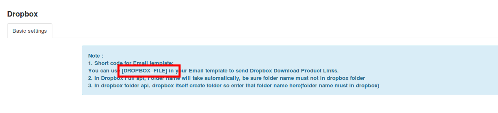
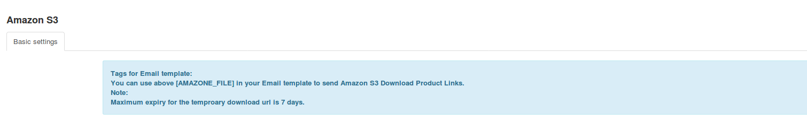

Many times you might want to send the link of your downloadable products to  the users through the email notifications they receive on placing the order.

This can be done with the help of two of our apps:

* [Dropbox](https://www.j2store.org/extensions/apps/dropbox.html)
* [Amazon S3](https://www.j2store.org/extensions/apps/amazon-s3.html)

These apps let you save your downloadable product files on Dropbox or Amazon s3 respectively and connect the buckets to your site.

**Prerequisites:**

You should have stored all your downloadable files on Dropbox or Amazon S3 respectively. 

To send the files in the email notifications:
 
Once you have installed the app and connected the store with the app, you would find the shortcodes in the app settings which you could use in the email templates.

**For dropbox:**

If you have your files on dropbox, please use the following shortcode in the email template:
[DROPBOX_FILE]

**For Amazon S3:**

If you have your files in Amazon S3, please use the following code on the email template:
[AMAZONE_FILE] 

