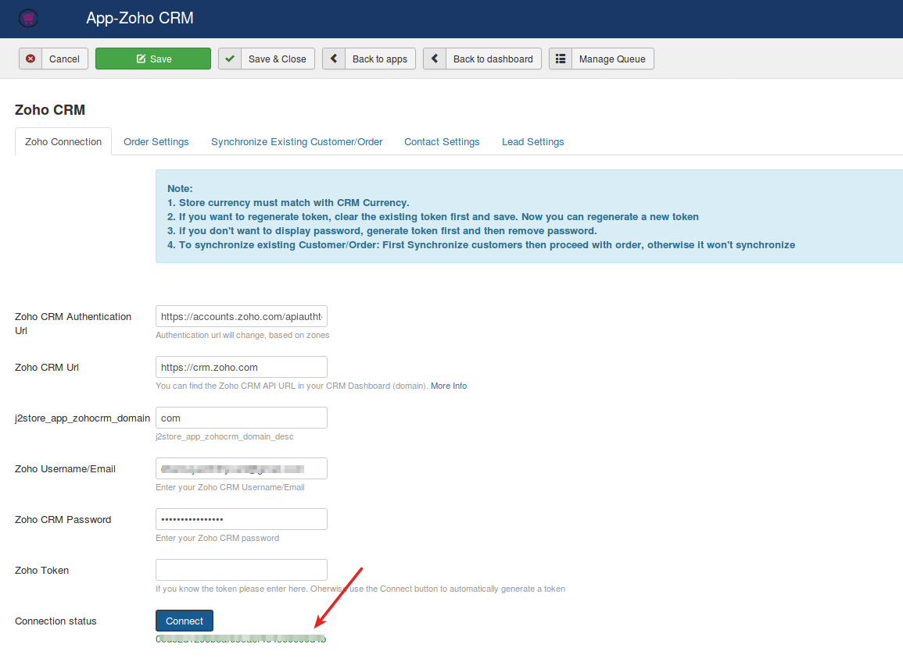
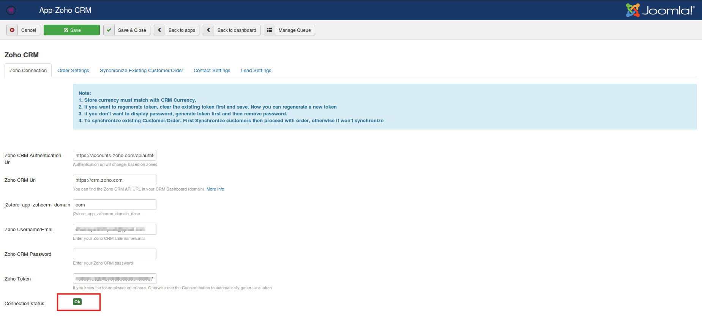
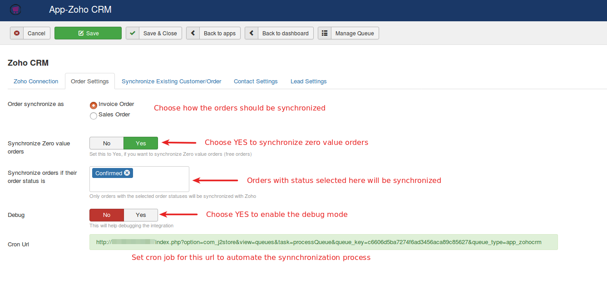
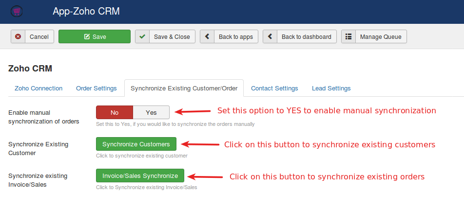
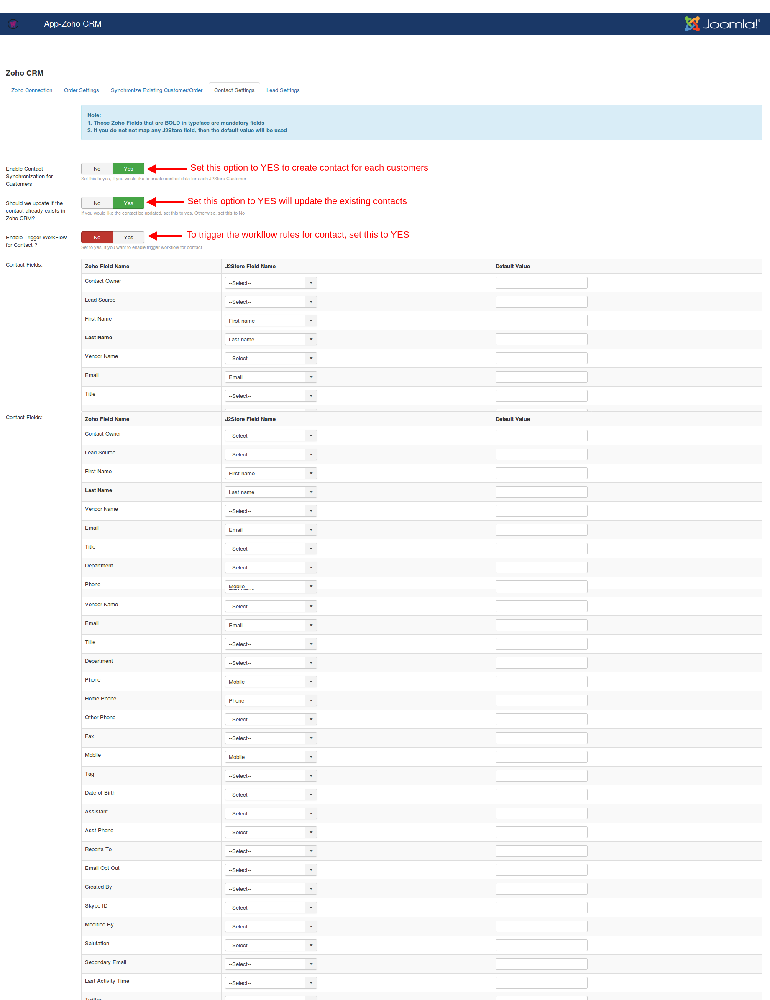
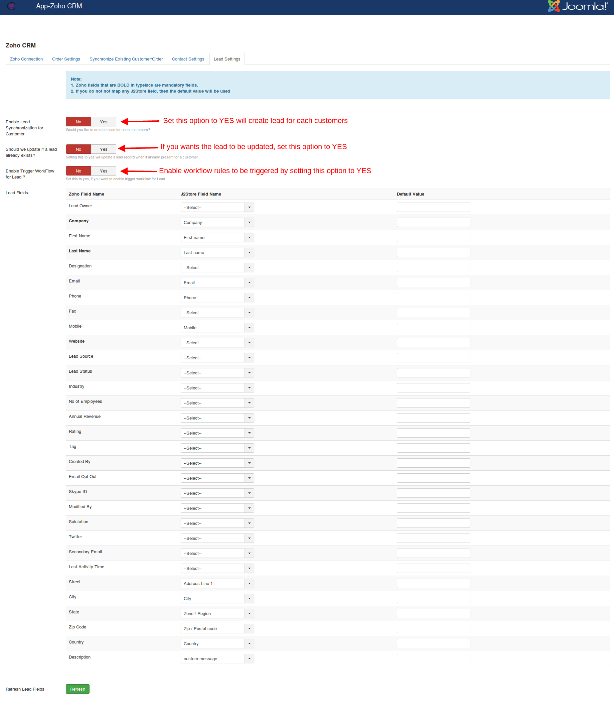

---

path: "/docs/apps/zoho-crm-integration"
updated: "2019-06-26"
title: "Zoho CRM Integration"
description: ""
author: "Kiruthigha"
category: "Apps"

---
The plugin that integrates J2Store with Zoho CRM, an automation tool that can automate daily activities of your sale.

Our plugin acts as a connector between J2Store and Zoho CRM and synchronize the customer and orders as a lead /or contact from J2Store to your Zoho CRM account.

`Store currency must match with the currency in your Zoho CRM account.If you want to regenerate token, clear the existing token first and save. Now you can regenerate a new token.If you don't want to display password, generate token first and then remove password.
To synchronize existing Customer/Order: First Synchronize customers then proceed with order, otherwise it won't synchronize`

**Installation**

Download our Zoho CRM integration plugin from our site's extensions section and install it in your site using Joomla installer.
After installing the plugin, go to J2Store > Apps and click Enable on Zoho CRM.
Once enabled the plugin, click on Open to configure the basic settings of the app.

**Configuration**

**Zoho Connection**

**Zoho CRM Authentication Url:**
Enter the authentication url for your region. This will be changed based on your zone/state. 

**Zoho CRM Url:**
Zoho CRM API supports multiple Data Center (DC) deployment that helps you manage and distribute your service across different geographical regions. 

You could get this Url from your account dashboard. 

**Zoho CRM domain:**

Enter the domain of your zoho CRM url here.
For example, if your zoho CRM url is https://crm.zoho.com, then enter com as your Zoho CRM domain. 

**Zoho Username / Email:**

Enter the User name / Email associated with your Zoho CRM account. 

**Zoho CRM Password:**

Enter the password that you gave at the time you created Zoho CRM account. 

**Zoho Token:**

If you already know the token, enter it here. You can also auto generate the token by clicking on Connect button. 

**Order Settings**

**Order synchronize as: **

Choose whether the order should synchronize as Invoice or Sales.

**Synchronize Zero value orders:**

If you would like to synchronize the orders having zero value, set this option to YES. 

**Synchronize orders if their order status is:**

Order that has status selected here only will be synchronized to Zoho CRM. 

**Debug:**

Choose YES to enable the debug mode. If you set this to yes, then debug messages will be logged and saved in the cache folder in your Joomla root directory. DO NOT select YES in the live site.

**Cron url **

You could automate the synchronization process by adding the cron job in your server for below cron url

**Synchronize existing Customer/Order**

Enable manual synchronization of orders:
Set this option to YES to enable the manual synchronization. 

**Synchronize Existing Customer:**

After installing this app, only the newly added customers will synchronize to the Zoho CRM. To synchronize the existing customers, click on Synchronize Customers button. 

**Synchronize existing Invoice/Sales:**

After installing this app, only the newly created orders will synchronize to the Zoho CRM. To synchronize the existing orders, click on Invoice/Sales Customers button. 

**Contact Settings**

**Enable Contact Synchronization for Customers:**
You could create contact for each customers by enabling this option. 

**Should we update if the contact already exists in Zoho CRM?**
Set this option to YES will keep the existing contacts updated. 

**Enable Trigger Work Flow for Contact ?**
If you would like to trigger the workflow rules for contact, set this option to YES.

**Contact Fields:**
Map the Zoho CRM fields to the J2Store fields. You could also enter the default value for each zoho CRM fields if there are no J2Store fields to map. 

**Lead Settings**

**Enable Lead Synchronization for Customer:**
Select YES if you would like to create lead for each customers 

**Should we update if a lead already exists?**
This option is used to update the lead record if it is already exist for customer. Select YES to this option to enable the feature of updating lead record. 

**Enable Trigger Work Flow for Lead ?**
If you would like to trigger the workflow rules for lead record, set this option to YES.

**Lead Fields:**
Map the Zoho CRM fields to the J2Store fields. You could also enter the default value for each zoho CRM fields if there are no J2Store fields to map. 

