# Amazon S3

Sell your files stored in Amazon S3 drive with J2Store Joomla eCommerce platform. The app enables you to connect your Amazon S3 bucket and sell the files securely.

Never worry about your files being shared in the vastness of Internet. The app generates a temproary url which will expire within minutes (you can control its expiry from the app settings), thus effectively preventing direct access to your files. The download url is also well masked. The app is suitable for those selling PDFs, Images, Audio and Videos, Extensions, Apps and more.

**Key Features**

- Sell any file stored in Amazon S3
- Enables you to retrive the files from the Amazon S3 bucket remotely.
- Generates a temproary url for the downlodable files, which expires within minutes
- Allows you to control the expiry of the url from settings

**Requirements**

- PHP 5.4 or higher
- Joomla 3.3 or above
- J2Store 3.2.x or above

**Installation Instructions**

1. Use the Joomla installer to install the app.
2. In the backend, go to J2Store Dashboard -> Apps as shown in the image below.
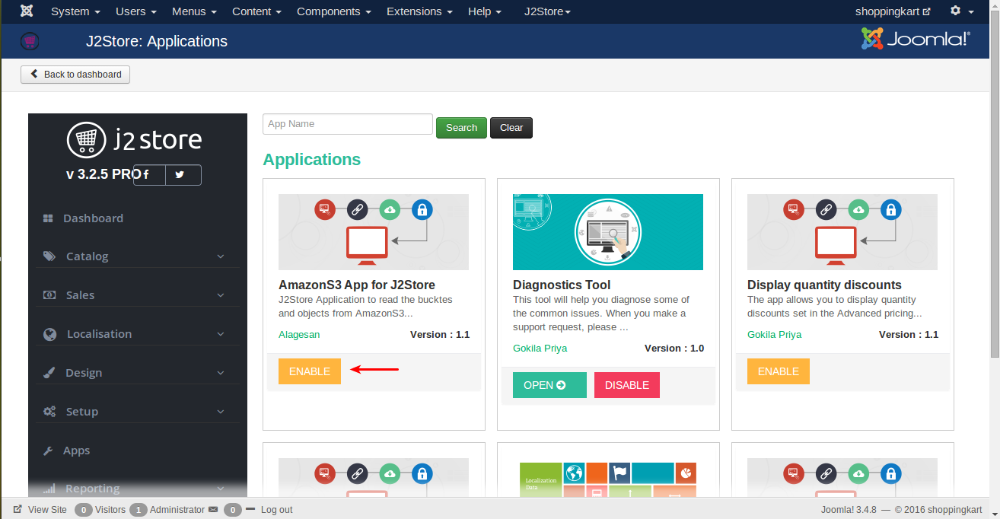

3\. Click Enable in the Amazon S3 app.

4\. Once the app is enabled, click on Open to set the configuration for the app.

**Parameters**

- API Access keyEnter the Access key ID provided by Amazon.
- Access secret keyEnter Access secret key provided by Amazon.Once you entered Access key ID and Access secret key, save it. You will get your bucket list.
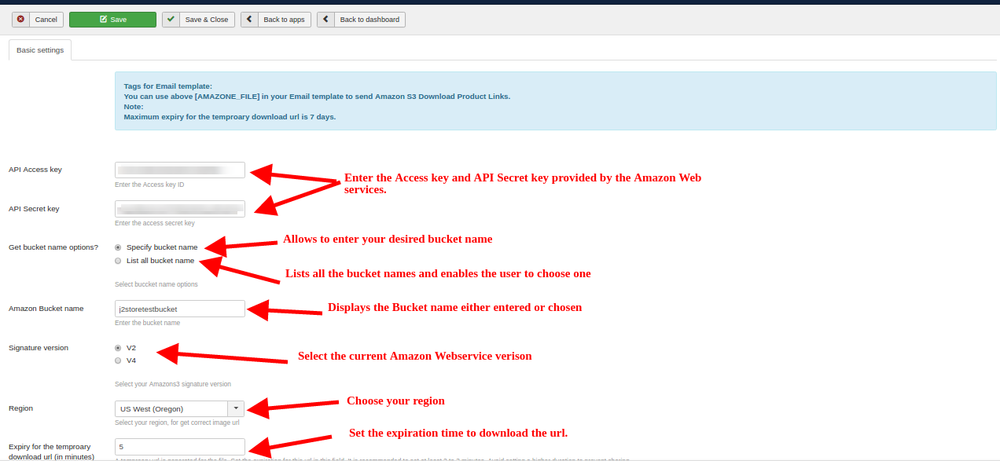

#### How to find your AWS Access Key ID and Secret Access Key

- Login into your Amazon web services account.
- Open the IAM console and under Security and Identity.

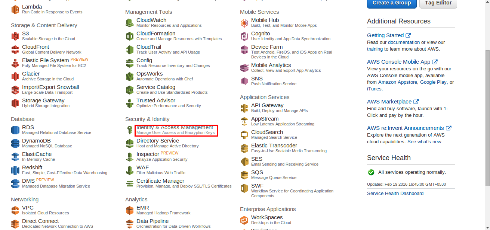

- In the navigation pane, choose Users.

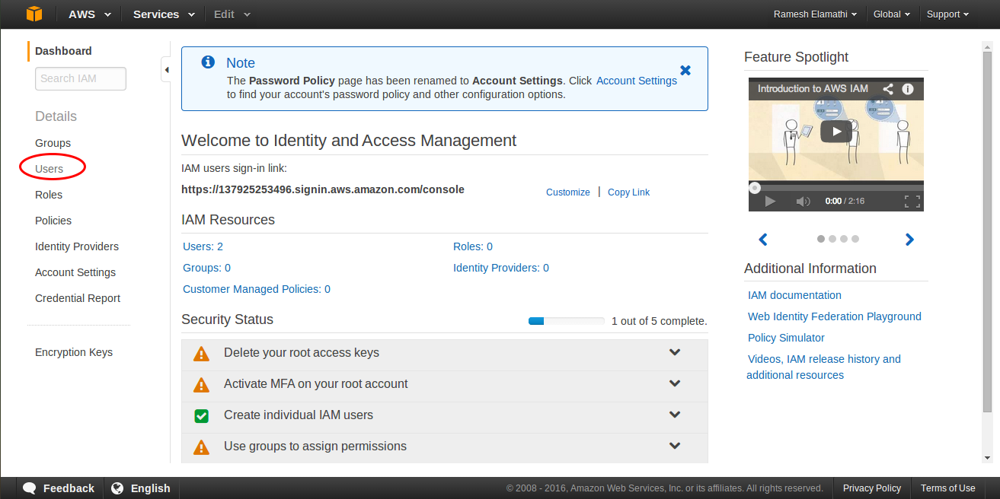

- Choose your IAM user name (not the check box).

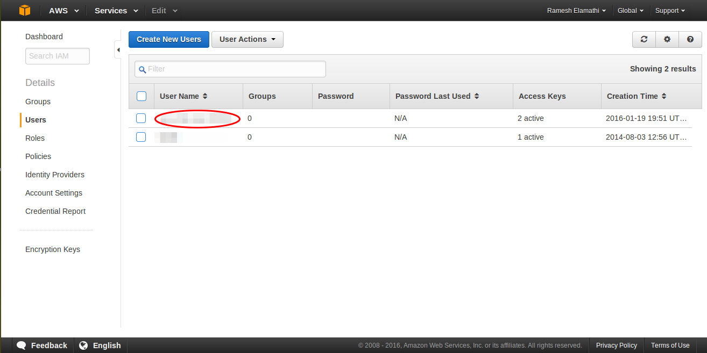

- Choose the Security Credentials tab and then choose Create Access Key.
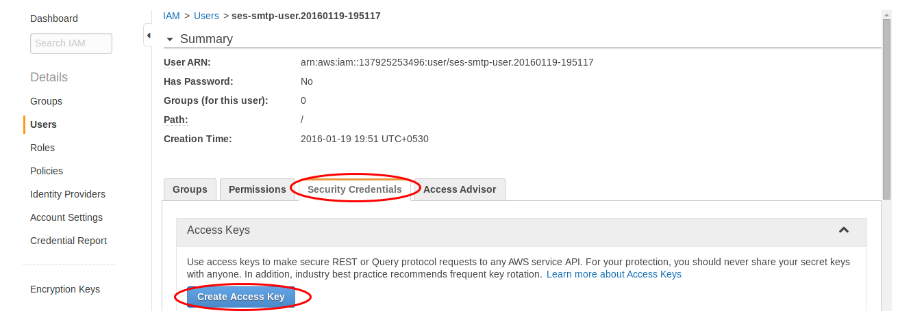

- To see your access key, choose Show User Security Credentials.

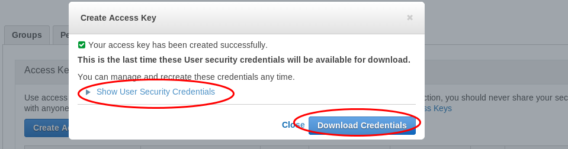

- Choose Download Credentials, and store the keys in a secure location.Your secret key will no longer be available through the AWS Management Console; you will have the only copy. Keep it confidential in order to protect your account, and never email it. Do not share it outside your organization, even if an inquiry appears to come from AWS or Amazon.com. No one who legitimately represents Amazon will ever ask you for your secret key.

<link-text url="http://docs.aws.amazon.com/AWSSimpleQueueService/latest/SQSGettingStartedGuide/AWSCredentials.html" target="_blank" rel="noopener">Please refer here for generating API key and secret key</link-text>

- **Get Bucket name options:**

1. **Specify Bucket name - ** option allows you to enter the bucket name based on your desire.
3. **List bucket name option -** will display all the Bucket names in a list format and enables to choose one.
- **Amazon Bucket name -** Displays the specified or choosen bucket name .
- **Signature version** enables user to choose the Amazon web service version used by them. 
- **Region - **Select the current region specified in your zone else the products wont be displayed.
- **Expiry for temporary download URL-**Set the expiration time to download URL.

#### How to sell the files using Amazon S3 ?

- Create a downloadable product and start selling. Create a J2Store product with product type as "Downloadable product". Configure all basic options such as price and navigate to the Files tab.

*Note :* Make sure you have set path to **Folder path for digital goods** in J2store configuration basic settings.
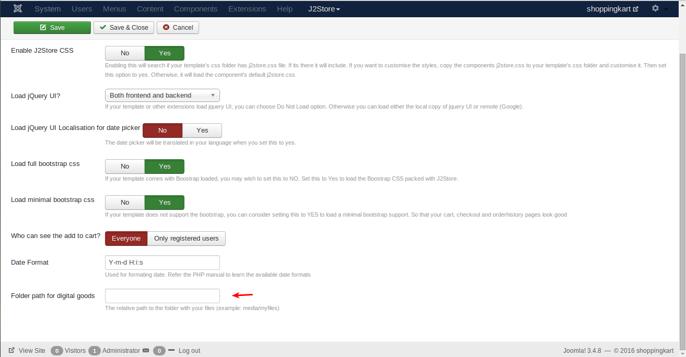
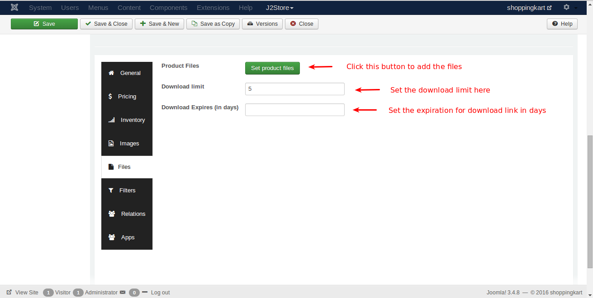
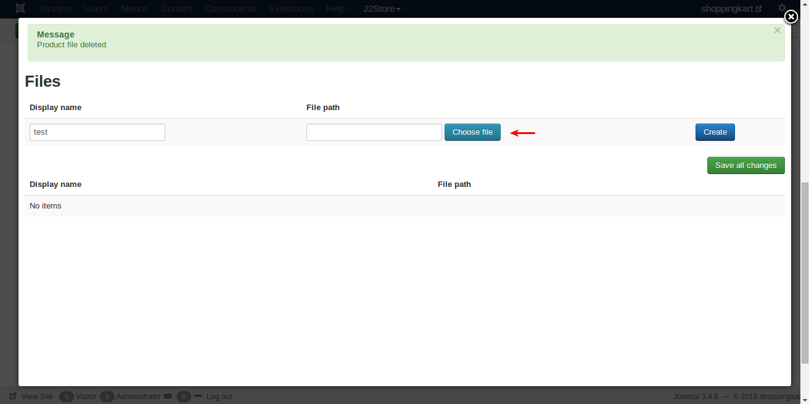
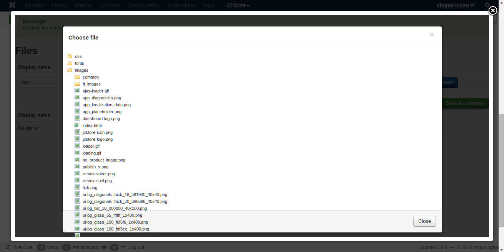
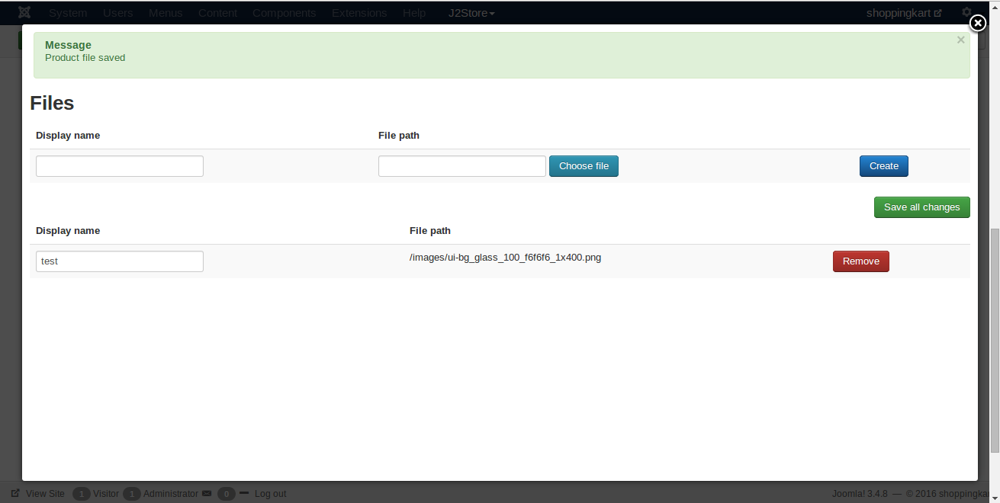

Save and close it.

**Video Tutorial**

