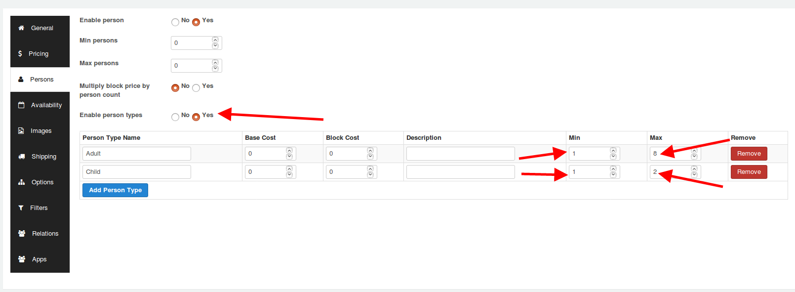

**Introduction**

 In the booking product type, there is a tab on the left pane of the product article called the Persons tab, which might help you in setting up restrictions based on how many people could book the product.

This section also allows you to set up minimum and maximum restrictions on people who opt for booking the product. This is ideal when your store sells event tickets.

**Steps to be done**

* Create a product of the type booking.
* Navigate to the persons tab after setting the pricing for the product.
* Set the option Enable person  to Yes.
*   Set the minimum persons to the minimum limit that you might want to set for the product.
* Set the maximum persons option to the maximum limit you might want to set for the product.
* If you wish to charge based on the number of persons, then set the option "Multiply block price by person count" to yes.
* When you wish to sell based on person types, then enable the option Enable person types.
* Once you have enabled the person types option, you would be provided with choices to create person types as per your requirements.
*   Save.

**Use case:**

Let us suppose that you are selling tickets  to a basket ball show and you wish to charge users based on if they are adults are children.
The minimum and maximum adults allowed per booking is 1 and 8 respectively.
The minimum and maximum children allowed per booking is 1 and 2 respectively.

**Setup:**
 

When the set up is as mentioned in the above screenshot, the minimum adults allowed would be 1 and maximum adults allowed per booking would be 8.
The minimum number of children allowed would be 1 and maximum number of children allowed per booking 2.

**Video Tutorial:**

 
 