Let us suppose that you have already created filters in a particular language and you wish to translate the filters to another language.
This is how you could do it.

**INSTANCE:**

**Languages available on the site**: English, German.
**Filters have been created in language:** English.
**Filters to be translated in language**: German.

###### Example:

Let us assume that we have got the following filter and following values for the filter:

Gender -filter title

Male -Filter value 1

Female -Filter value 2

###### Steps to be done:

* Please navigate to J2Store->Catalog->Filters/specifications

*  Edit your filter, in our instance, it is the Filter with the title "Gender"
*  Replace the title with the following language constant(please note that this is custom-defined, you could use any constant on this. Just make sure that you have mentioned the constant in UPPERCASE letters. And make sure that you use the exact constant in the language overrides that we are going to create): J2STORE_FILTER_GENDER

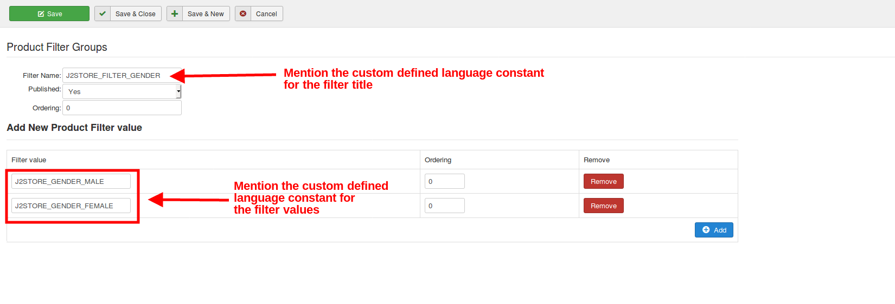

*  Now, replace the values of the filter with custom language constants like this: J2STORE_GENDER_MALE, J2STORE_GENDER_FEMALE

*  Now that we have defined our constants, our next step is to create the language override
*  Navigate to Extensions->Languages->Overrides->Choose the language German
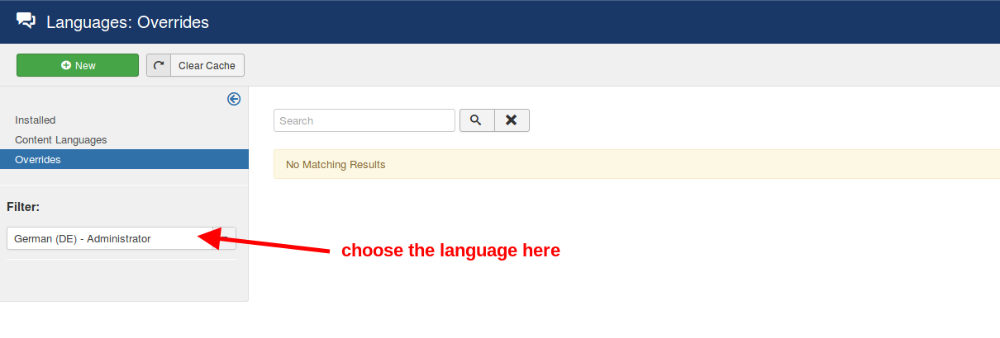
*  Click the new button and create a override for the constant:  J2STORE_FILTER_GENDER
*  Create an override for the other two constants as well in the same language 
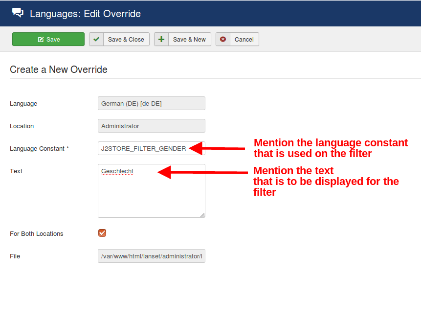
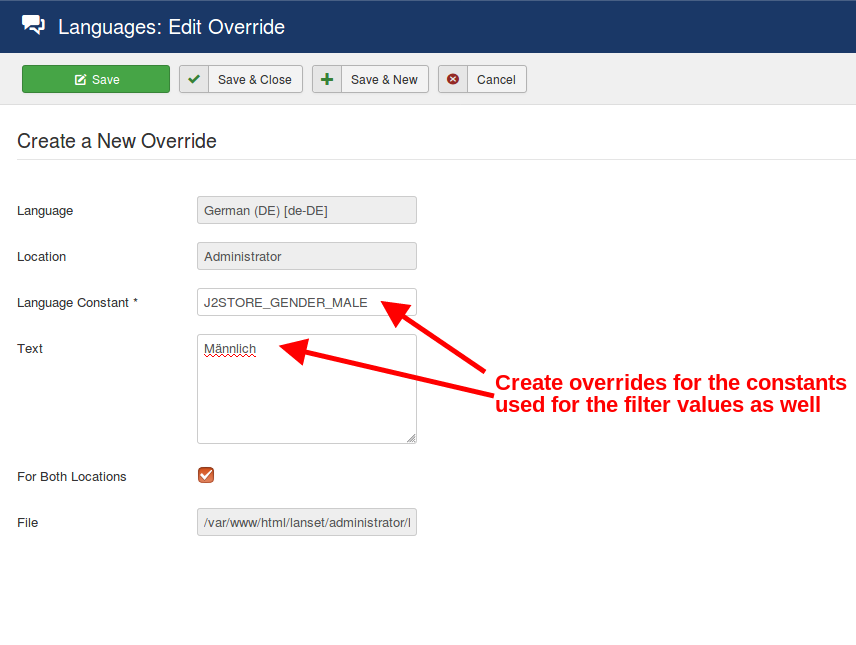
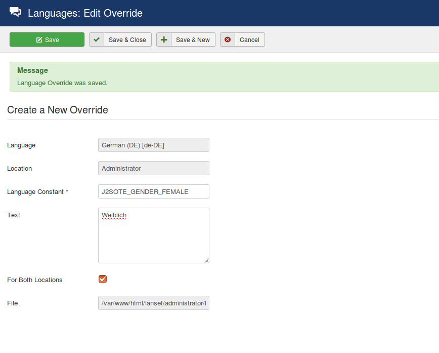

*  Choose the language as English at the languages filter
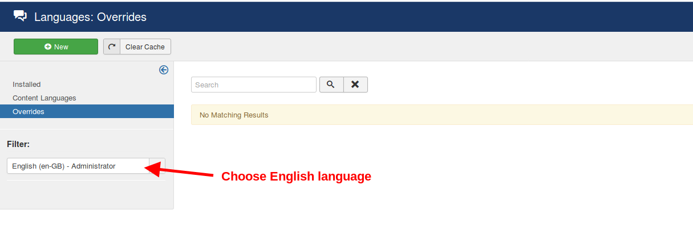

* Create language overrides for the three constants here as well and mention the text that has to be displayed on the English site for this filter and the values
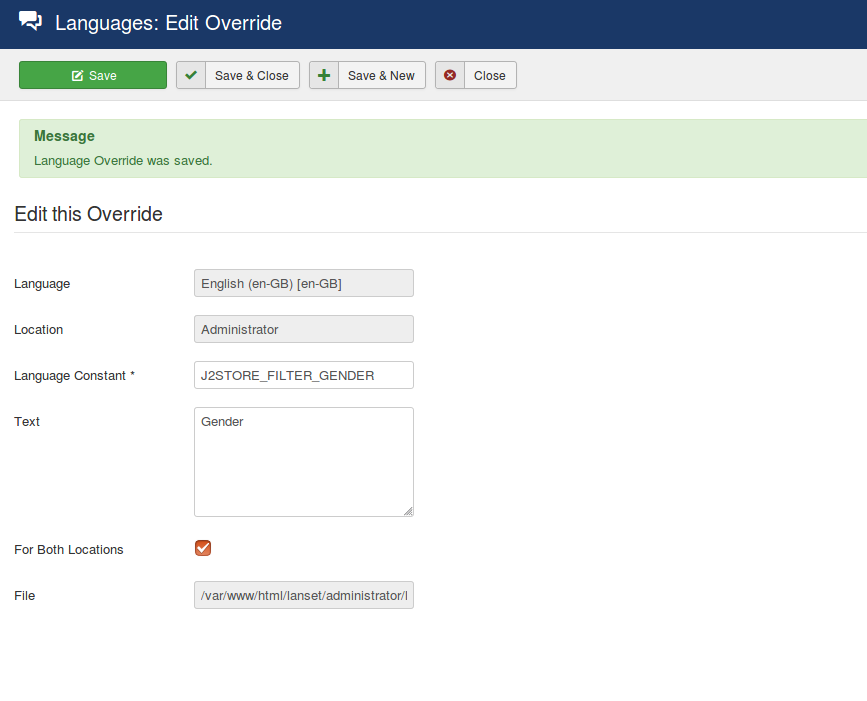
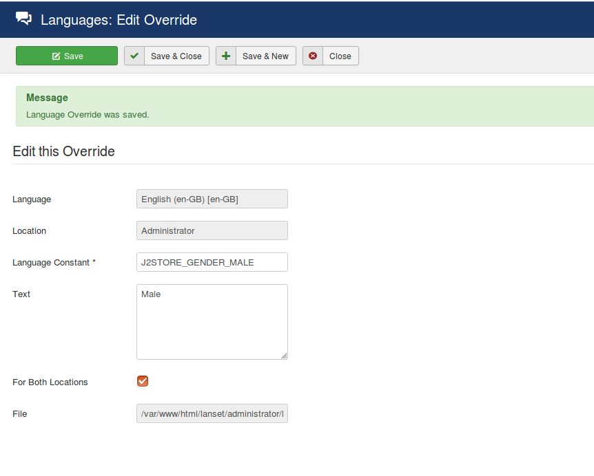

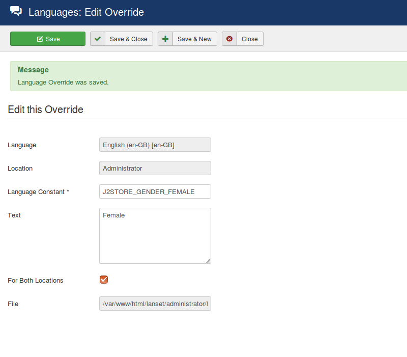

* Assign the filter and its values to the products you desire under the Filters tab of the product article of both the English and German language 

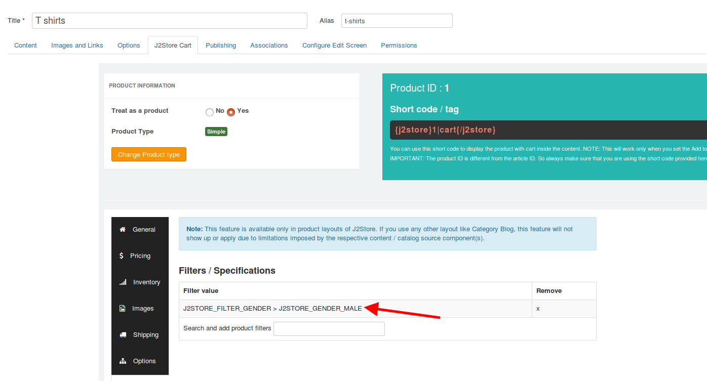
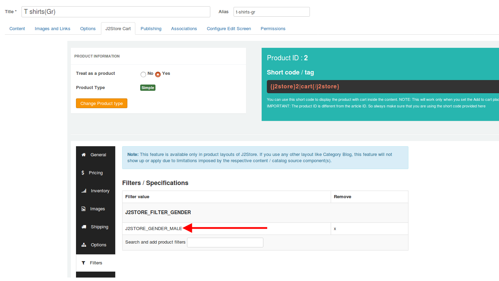

* Navigate to frontend and you would see the texts that you defined in each language for the constants in the place of the filters respectively

###### English language: 
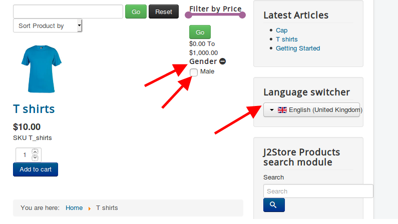

###### German language: 

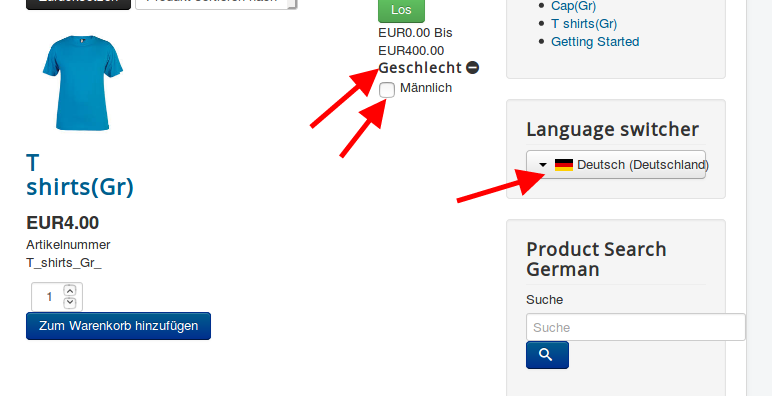
