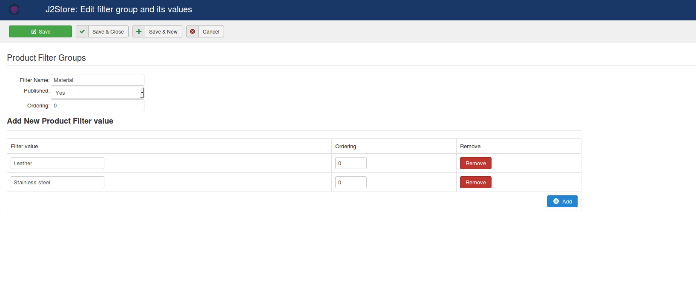
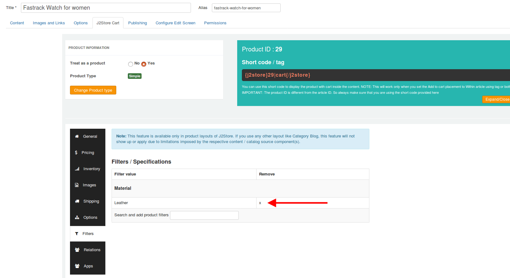
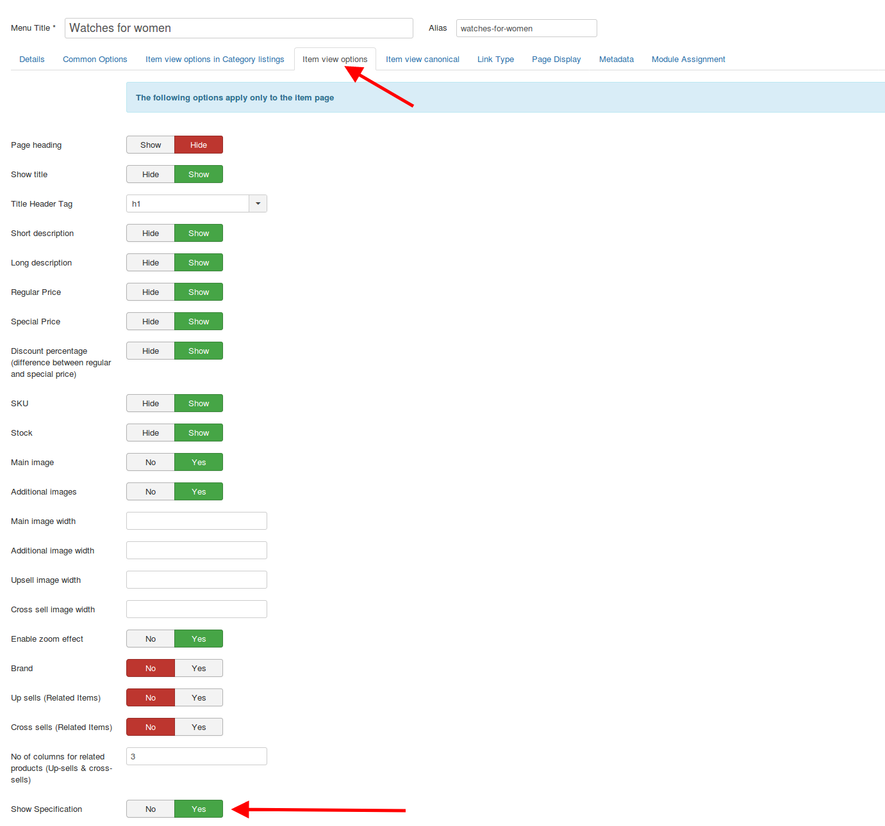
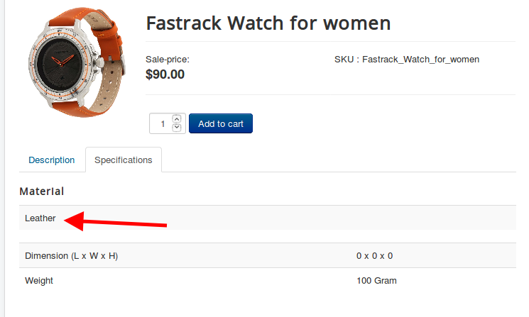

# Adding Specifications to your products

**Steps to be followed:**

- Navigate to J2Store->Catalog->Filters/ Specifications.
- Create a filter named Material and add values Leather and Stainless steel to the filter.
- Create another filter named dial color and add values to it accordingly.
- Move to the product's article and click on the filters section. 
- Type in the name of the filter's value created and save the article post adding the filter values.
- Navigate to Menu manager->Choose your product's menu->Item view options->Show specifications->Show.
- Save. Now the product's item view would have the Specifications listed in a separate tab named Specifications.

**Screenshots:**

**Video Tutorial:**

