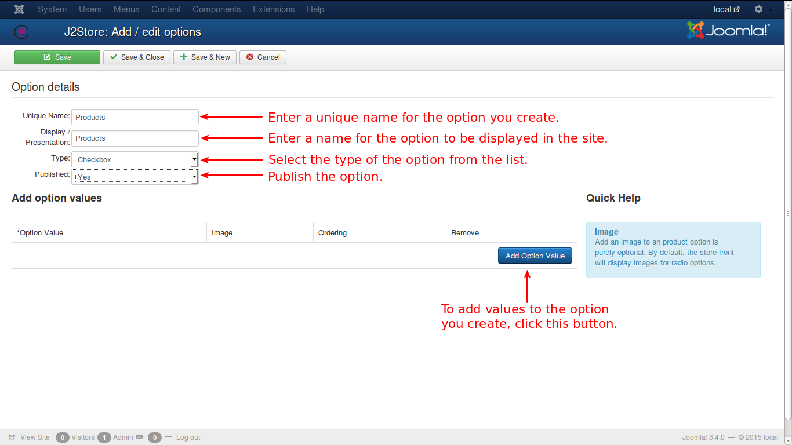

In this page, the information to add new custom options are given.

**Unique Name**

A unique name should be given for every option since ambiguity should not arise out of that. Otherwise, if two options have same name, things would mess up.

**Display / Presentation**

What is given here will be displayed for that option.

**Type**

There are 9 types of options available in J2Store. Of the 9, 3 options have multiple option values. Here is how it goes...

1. Dropdown
2. Radio
3. Checkbox

**Dropdown** will have a select list and the available options will be listed. Usually only one option is selected from the list.

- E.g., if a country is to be selected from a list, one can select only one from the list.

**Radio** In this option, all the available options will be shown in the screen and only one option can be selected.

- E.g., to choose the Gender of a person, normally Radio buttons are used and obviously only one can be selected at a time.

**Checkbox** This option provides facility to select multiple options at a time.

- E.g., if the products are listed and asked to select, multiple check boxes can be checked simultaneously to select the products.

If these options are selected from the list, then a new row of fields will appear to enter the option values for the selected option. Any number of option values can be added to the selected option.

Other available options are:

- Text
- Textarea
- File
- Date
- Time
- DateTime

For these options, setting up of option values is not possible.

**Important Note:** Except *Dropdown* and *Radio*, all other options are available only in **J2Store PRO** version.

Also, the images set for the options would only be visible for radio type options and not others.

**Limitations**

 NOTE: The variable product type alone does NOT support Text, Textarea, File, Date, Datetime and time option types.

In other words variable product type supports only Radio and Dropdown option types.**

**Video Tutorials:**

 Here are videos that could help you create options and associate them with products:

