# Setting up tax for your products

**Requirement for the tax to take effect:**
- Geozone has to be set up for which the tax has to apply.
- Tax rate has to be set up.
- Tax profile has to be created.
- Tax rate has to be associated with the tax profile.
- Tax profile has to be assigned to the products for which tax has to be levied.

**Instance: 

Tax geozone: USA

Tax rate: 10%

Tax profile name: US-TAX**

**Steps: **

- Navigate to J2Store->Localisation->Geozones and create a new geozone.

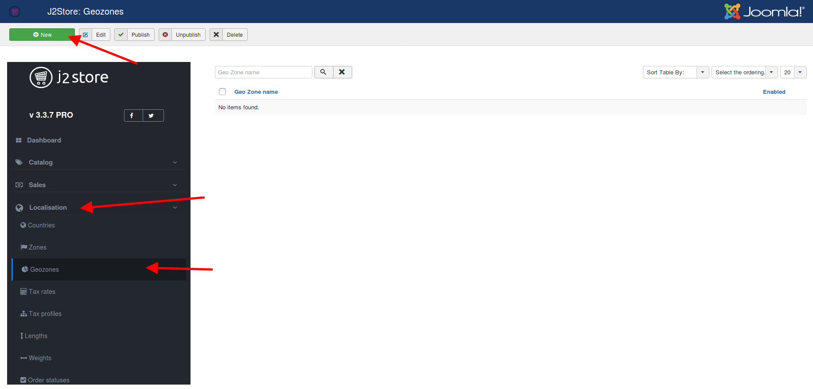

- Type in a name for the geozone, add the countries for which the tax has to be applied.

1. Case A: Apply tax only for few zones within USA.

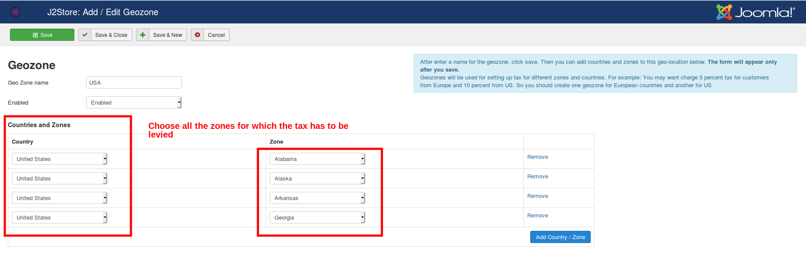
 2. Case B: Apply tax for all zones within USA. 

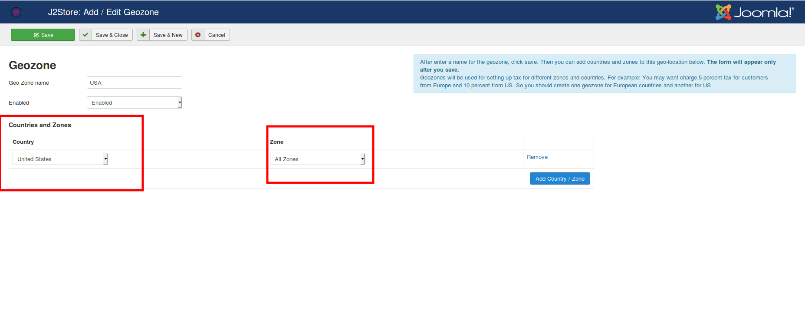
- Navigate to J2Store-> Localisation->Tax rates->Click new. 
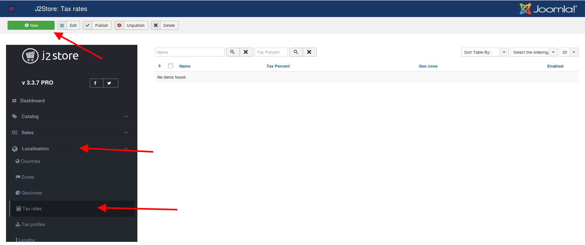

-  Fill in the name, tax percentage, geozone and publish the tax rate.
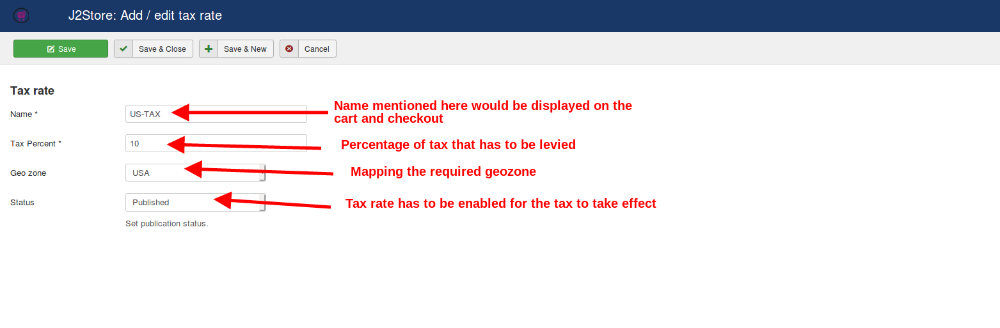
- Navigate to J2Store->Localisation->Tax profile->New.
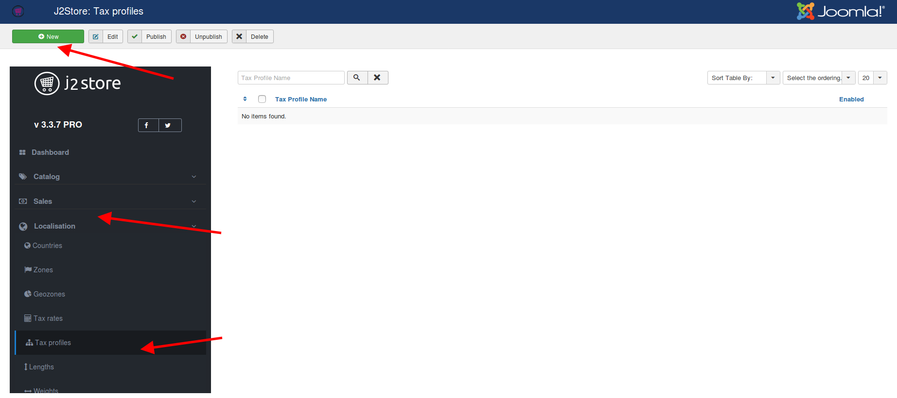

Fill in the profile name, set the status and map the tax rate on the profile, choose the associated address.

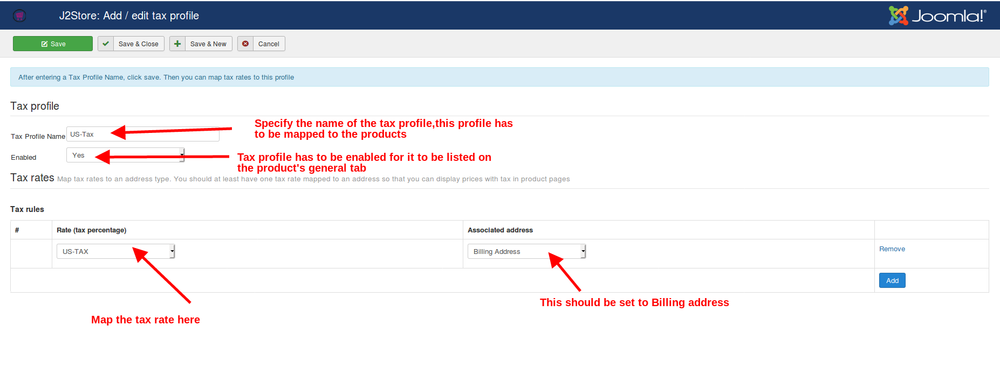
- Navigate to J2Store->Catalog->Products(Or Content->Articles).
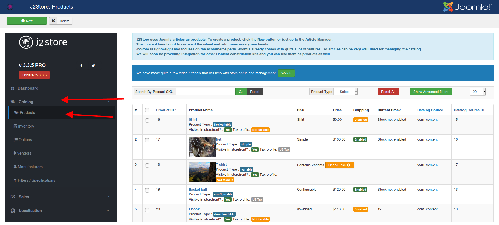

- Edit the products for which you wish to collect tax. Navigate to the J2Store cart tab. Choose the tax profile and save.
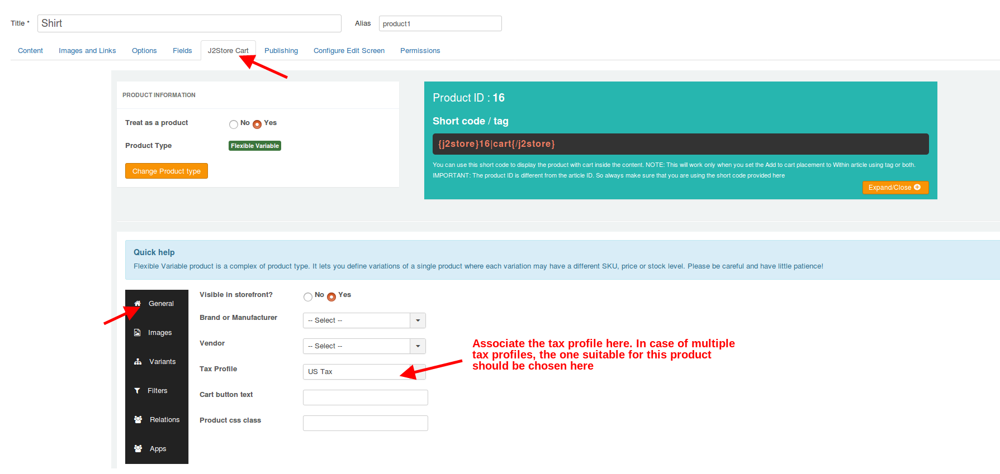

- Frontend:
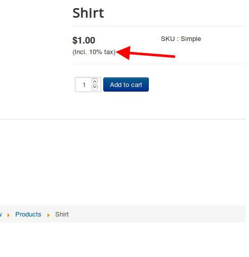
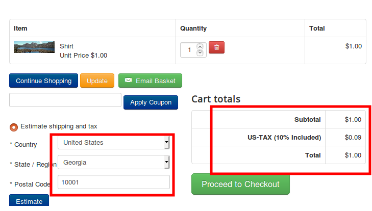

Thus tax would be levied on the product as per the configuration. 

**Issues:**

Please refer the following list of troubleshooting steps:

**[http://docs.j2store.org/troubleshooting-guide/troubleshooting-tax-issues](<http://docs.j2store.org/troubleshooting-guide/troubleshooting-tax-issues>)

