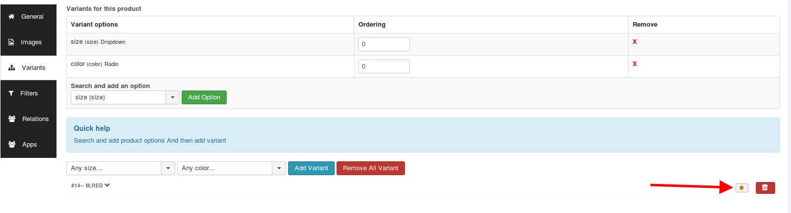
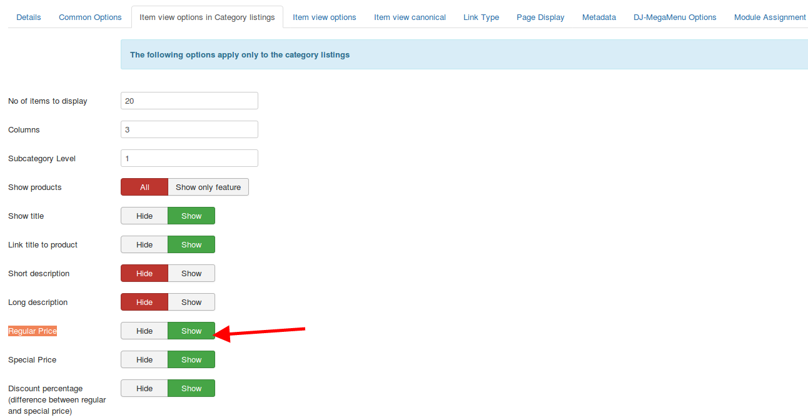
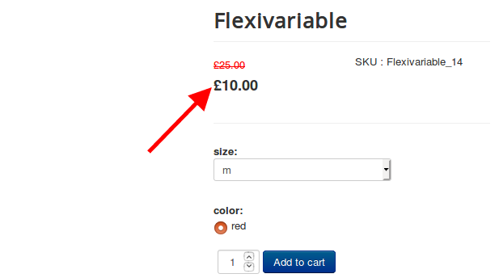
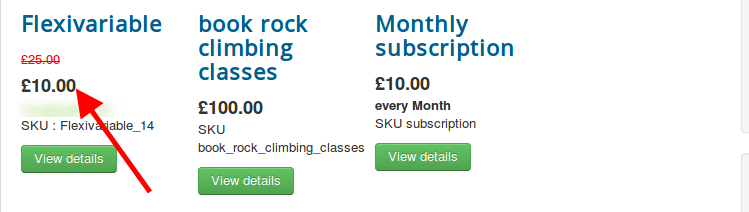

If you don't like the price range of the variants getting displayed on the storefront, then you could replace it with the default base price. 

Following are the steps to be followed:
**Steps:**

- Navigate to the Flexi variable product.
- Set the default variant by clicking on the star next to the variant.

- Navigate to the menu manager->choose the menu of the flexi variable product.
- In the item view options in category listings and Item view options tab, set the option	**Regular Price to Show and base price to show.**


- Navigate to /templates/your template/html/com\_j2store/templates/<link-text url="http://docs.j2store.org/catalog/where-can-i-find-my-sub-template" target="_blank" rel="noopener">sub-template</link-text>
- Create a file called "default\_flexiprice.php" and paste the following code:

```
&nbsp;<link-text url="https://gist.github.com/sowbagyalakshmi/451d33fce24cf111b29e06e23b6be6d1" rel="noopener" target="_blank">https://gist.github.com/sowbagyalakshmi/451d33fce24cf111b29e06e23b6be6d1</link-text>
```

- At the same path, create another file called view\_flexiprice.php and paste the following code:

```
<link-text url="https://gist.github.com/sowbagyalakshmi/d1a1749bf17c45c0ca251bde4ba60ed3" rel="noopener" target="_blank">https://gist.github.com/sowbagyalakshmi/d1a1749bf17c45c0ca251bde4ba60ed3</link-text>
```

Now the base price would be displayed instead of the price range.







