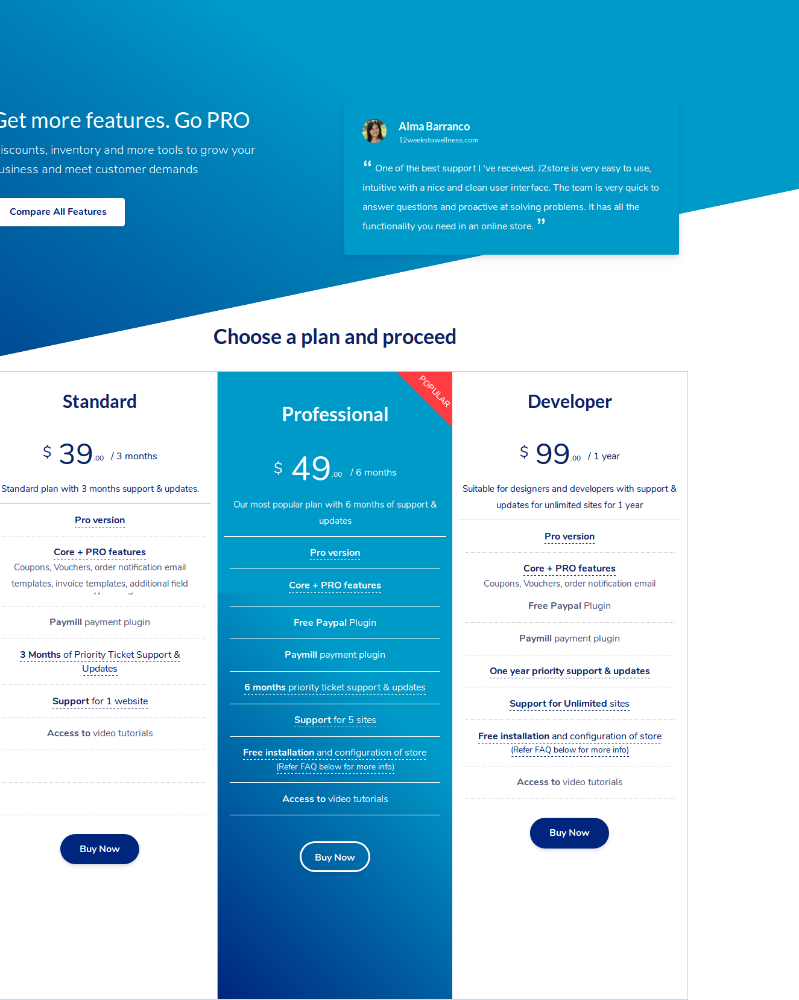
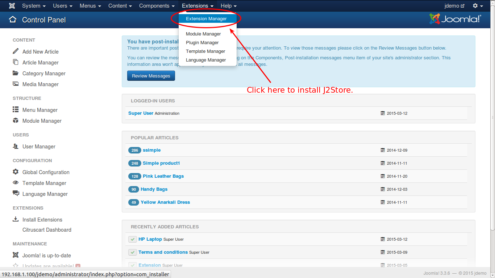
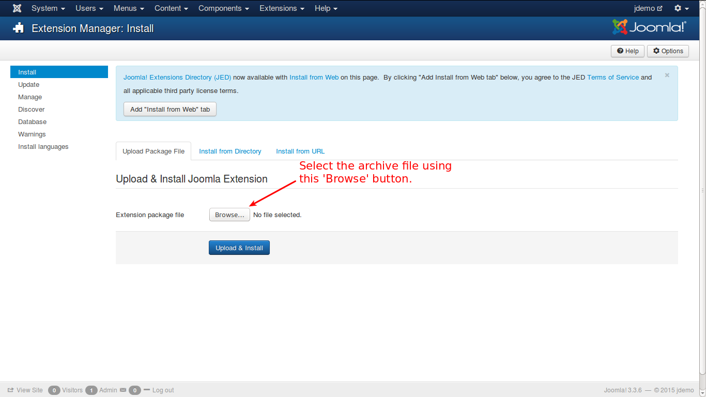
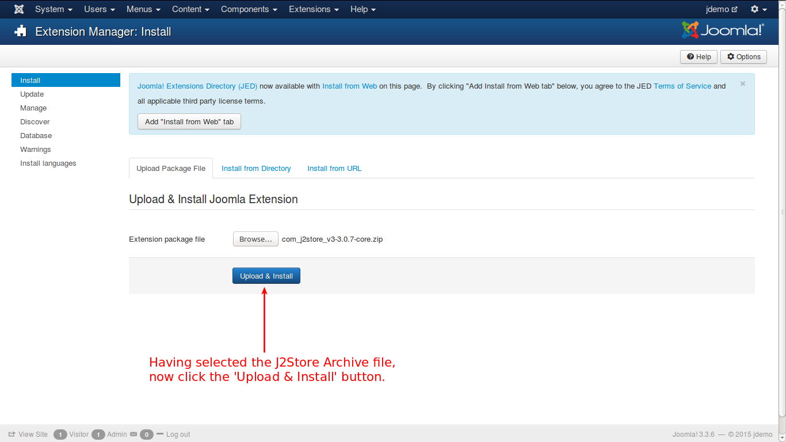
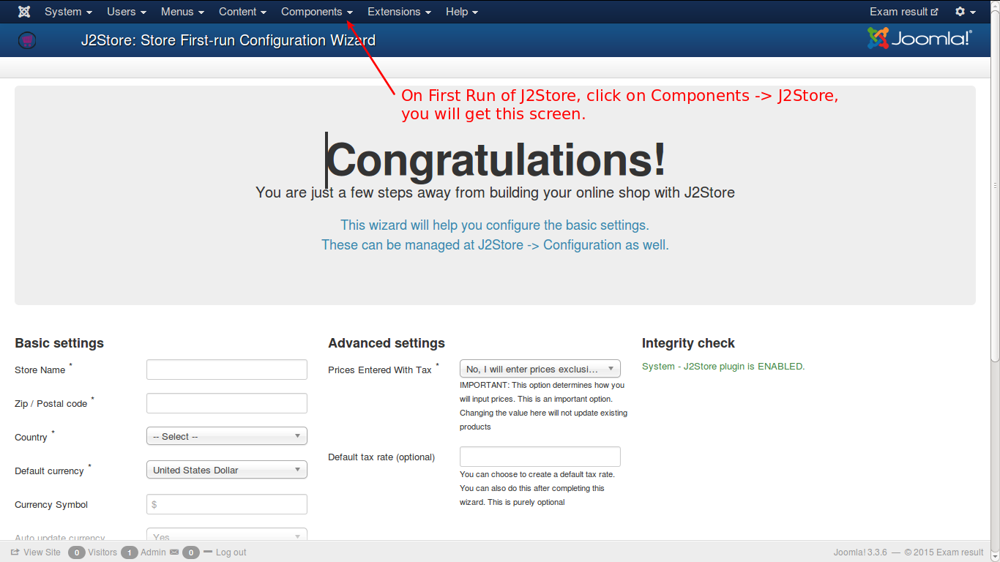
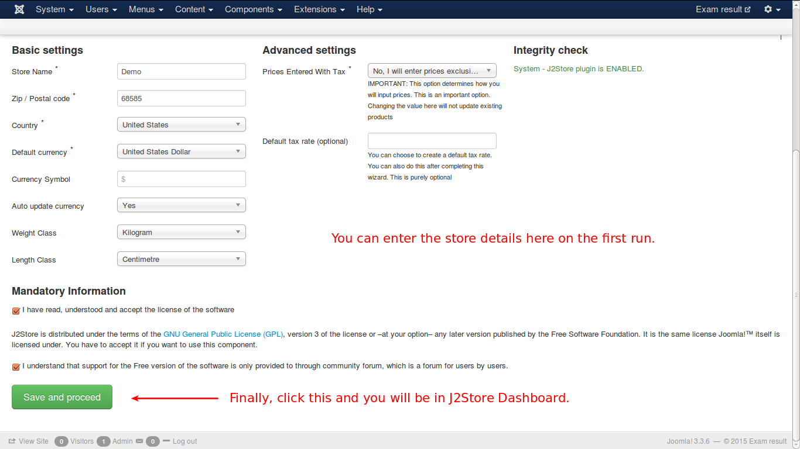
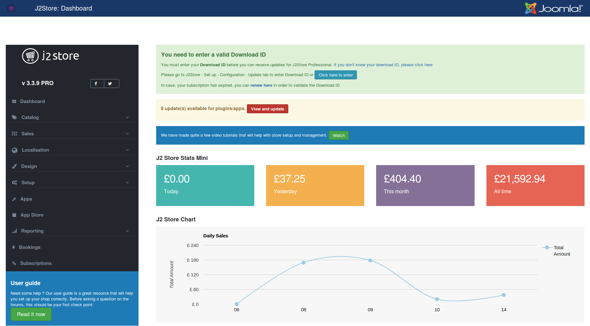

To install J2Store, you need j2store archive downloaded or purchased from[ <link-text url=”http://www.j2store.org/download.html” target=”_blank” rel=”noopener”>www.j2store.org](http://www.j2store.org/download.htm).</link-text>

**J2Store Versions**
There are four plans available in j2store shopping cart extension.

*   Basic
*   Standard
*   Professional
*   Developer

Have a look at the image below:

**Basic** plan is free and gives you access to download J2Store Core version from

To install J2Store, you need j2store archive downloaded or purchased from <link-text url=”http://www.j2store.org/download.html” target=”_blank” rel=”noopener”>www.j2store.org](http://www.j2store.org/download.htm).</link-text>

Remaining are for-a-fee plans which gives access to J2Store PRO version. You can choose any of the four and get a copy of the extension.

**Installation**

In your Joomla control panel top menu, go to Extensions -> Extension Manager, as illustrated below.

When you click here, you will be directed to the screen where you can select the downloaded/purchased packaged. See the image below:

As illustrated, select the package file and click 'Upload and Install'.

J2Store is now installed and you will get this success message, as illustrated below.

Now go to the topmenu->components->j2store, you will get the configuration screen as shown below:

Enter the details for your online store as shown below.

And here is the J2Store Dashboard.

