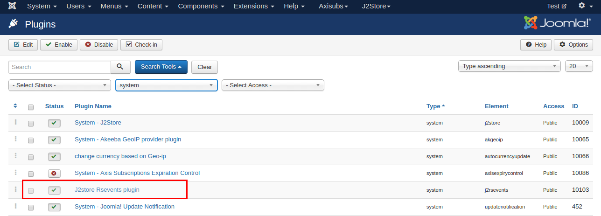
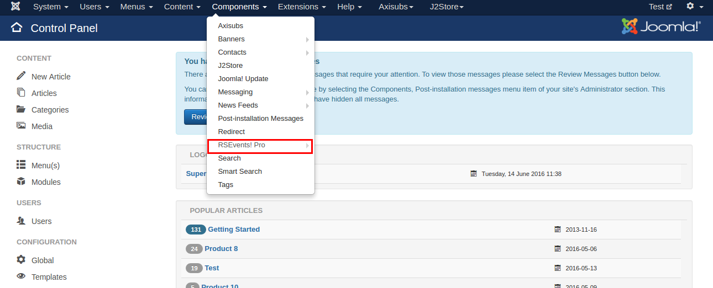
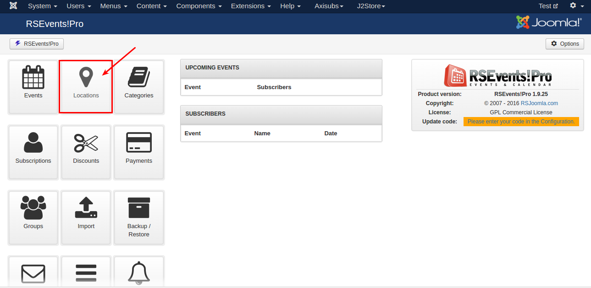
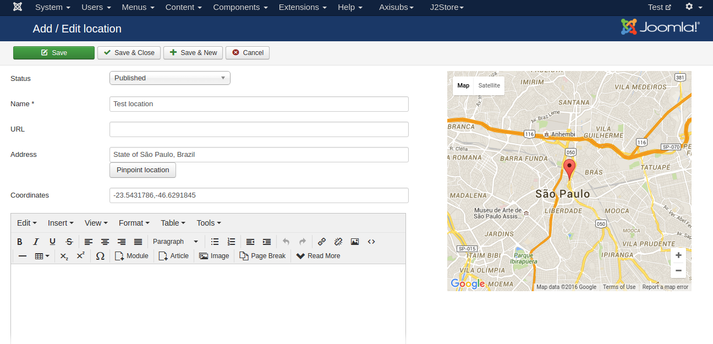

This plugin integrates RS Events PRO with J2Store. With this plugin, you can treat your events as products.

**Requirements**

* PHP 5.3 or higher
* Joomla 3.x
* J2Store 3 or above
* RS Events PRO (Component, Modules, Plugins)

**Installation**

1. Download the RS Events PRO from Joomla extension directory http://extensions.joomla.org/extension/rsevents-pro
2. Extract the downloaded package RSEventsPro[UNZIPME_1ST].zip
3. Open the component folder inside the extracted package. Inside the component folder, you can see the com_rseventspro_2.5-3.x-v1.9.25.zip.
4. Install the above mentioned package using joomla installer.
5. Once installed the RS Events PRO component, download and install J2Store RS Events Pro integration.
6. After installing the J2Store RS Events Pro integration, Go to Extenisons > Plugins. Choose the search type system and enable the J2Store RSEvents plugin.

**Backend (Creating Events)**

Go to Components > RSEvents PRO > Dashboard

Before start creating Events, you must have to save the location and category.
To create the Location, select Location in the dashboard.

Click NEW on top left
Status should be set to Published. Enter the name, address and save the location. Refer the below screen

Now select categories from left pane and click NEW to create new category.

Enter the name for the category and set the status to Published and save.

Now select Events from the left pane and click NEW to create new event.

Fill all the informations required for your event and navigate to the J2Store tab in left menu pane.

Choose YES to treat Event as Product and select the product type and save.

Once saved, now you can able to set product price, images, options, etc.

**Frontend**

It is very simple to show your evens in frontend.

Go to Menu manager and add a new menu item with menu type as RSEvents PRO > Events.

Now go to your site frontend and check the menu you have created

