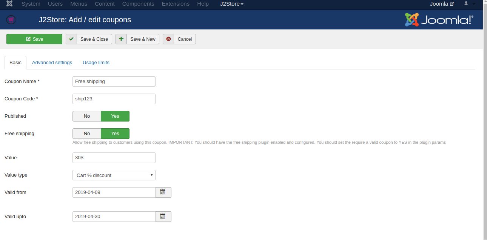
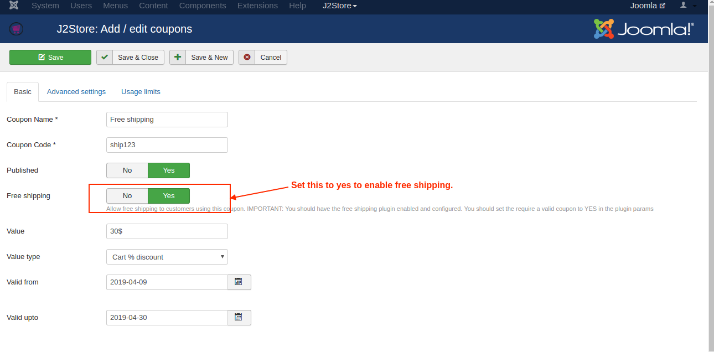
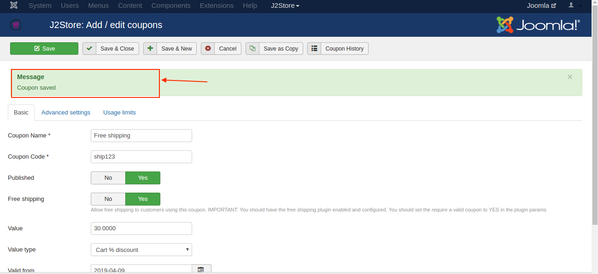
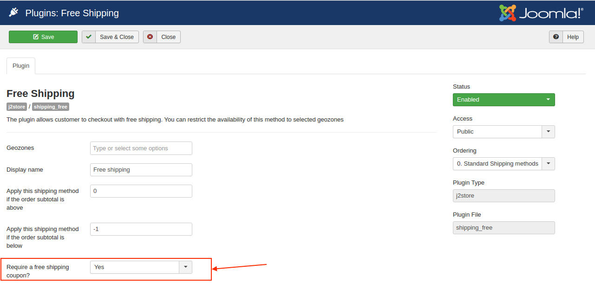
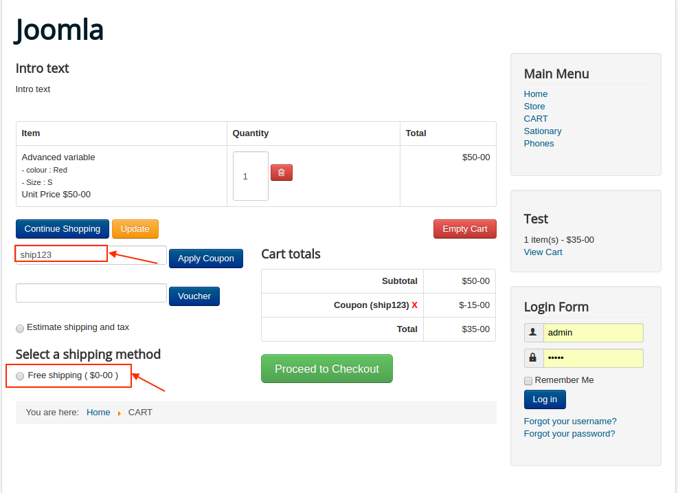

# How to create coupons for free shipping?
This is J2Store PRO exclusive feature

Coupons preloaded with specific values enables customers to shop online with no shipping cost.

Create a coupon and add the details of the coupon such as Coupon Name,Coupon Code, Published ,Value, Valid from and Valid upto etc.

In the coupon creation page you will find an option **FREE SHIPPING.**Enable this to yes in order to make shipping free of cost.

Save the created coupon and a pop-up message stating "Coupon saved" will be displayed.

Navigate to J2Store->Setup->Shipping methods . Click on the create/edit/view option next to the free shipping plugin. 

In the free shipping page you will find an option "REQUIRE A FREE SHIPPING COUPON".Set the value as yes .

Now a free shipping coupon is created . You can customize the coupon by limiting the product category,Product,Users , usage etc.

**Note : This method will only show up only when the user estimates the shipping post applying the coupon.**

**Video tutorial:**

